# Pinocchio 🎯

## Basic Details
### Team Name: Pointless

### Team Members
- Member 1: SNOOPA K - NSS COLLEGE OF ENGINEERING,PALAKKAD
- Member 2: SAI KRISHNA -  NSS COLLEGE OF ENGINEERING,PALAKKAD
- 
### Project Description
A closed-loop, real-time acoustic-to-kinematic transduction system — or, in terms a human might use, a puppet that hears music and immediately loses all composure. Built on an Arduino UNO, a KY-038 acoustic front-end, a PCA9685 12-bit PWM servo controller, and four SG90 actuators, the system continuously samples ambient sound pressure, classifies it against a calibrated threshold, and converts qualifying acoustic events into a synchronized, pre-programmed limb-actuation sequence. In simpler terms: it hears a bop, and it *becomes* the bop.

### The Problem (that doesn't exist)
Modern acoustic playback technology has, regrettably, solved the problem of listening to music. This is a crisis. Humanity can now hear songs perfectly well *without* a nearby entity physically reacting to every single beat, and frankly, that's an unacceptable gap in the audio experience. Somewhere, right now, a perfectly good drop is happening and nothing is visibly losing its mind about it. We consider this a systems failure.

### The Solution (that nobody asked for)
We engineered — and we use that word with complete sincerity and zero shame — an autonomous acoustic-to-motion translation pipeline. Strip away the sensor fusion vocabulary and what you actually get is: a microphone hears something loud, and a small puppet immediately throws its arms and legs around like it just remembered something embarrassing from 2019. Four servos, one Arduino, one increasingly judgmental audience — and now, no beat goes undanced-to.

## Technical Details
### Technologies/Components Used
For Software:
Languages used: C/C++ (Arduino)
Frameworks used: Arduino Framework
Libraries used: Wire.h, Adafruit_PWMServoDriver.h
Tools used: Arduino IDE, Arduino Serial Monitor, Arduino Serial Plotter, Git & GitHub

For Hardware:
Main components:
-Arduino UNO
-KY-038 Sound Sensor Module
-PCA9685 16-Channel PWM Servo Driver
-4 × SG90 Servo Motors
-2 × 3.3V Li-ion Batteries
-5V Boost Converter
-Breadboard
-Jumper Wires

- **Specifications:**
  - **Arduino UNO** — ATmega328P microcontroller, 5V logic; the brain of the operation, and the only member of the team not currently overreacting
  - **KY-038** — Analog sound detection via the AO pin; converts "the vibe in the room" into a number the Arduino can panic about
  - **PCA9685** — 16-channel, 12-bit PWM servo controller communicating over I²C; frees the Arduino from having to babysit four separate PWM signals like a stressed stage manager
  - **SG90** — 9g micro servo, ~4.8–6V operating range; the actual muscle behind the chaos
  - **Li-ion batteries** — 2 × 3.3V cells wired in parallel to bump up available current without touching the voltage, because four simultaneously flailing servos are not a "trickle current" kind of workload
  - **Boost Converter** — Steps the battery pack up to a clean, regulated 5V rail dedicated entirely to the servos, kept electrically separate from the Arduino's own supply so the microcontroller doesn't brown out every time the puppet gets excited

Tools required:
USB cable
Breadboard
Jumper wires
Soldering iron (optional, if using soldered/permanent connections)
Wire cutter/stripper
Hot glue gun
Scissors/craft knife
Cardboard/foam board for puppet construction

### Implementation
For Software:
# Installation
1.Install Arduino IDE.
2.Connect the Arduino UNO to the computer using a USB cable.
3.Open Arduino IDE.
4.Install the required library:
5.Adafruit PWM Servo Driver Library
6.Select:
  Tools → Board → Arduino UNO
  Tools → Port → Select Arduino COM Port
7.Open the project .ino file.

**Run**
1. Wire the KY-038 sound sensor and PCA9685 according to the circuit design.
2. Connect the four SG90 servos to PCA9685 channels 0–3.
3. Power the servos exclusively via the 5V boost converter — never off the Arduino's own rail.
4. Connect the Arduino UNO to your laptop via USB.
5. Click **Upload** in the Arduino IDE.
6. Once uploaded, power on the circuit.
7. The Arduino boots up and immediately starts eavesdropping on the room.
8. When the KY-038 detects sound crossing the defined intensity threshold, the puppet executes its pre-programmed dance sequence with complete commitment.
9. On sequence completion, it resets and resumes listening for the next excuse to dance.

### Project Documentation
For Software:
# Screenshots 
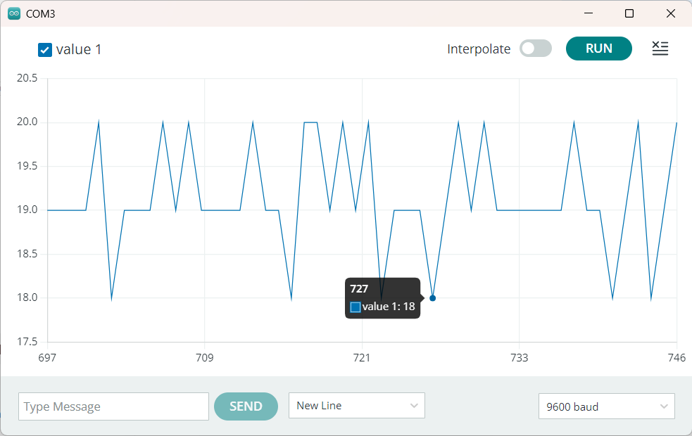
Shows the Arduino Serial Monitor displaying real-time sound sensor readings received from the KY-038.

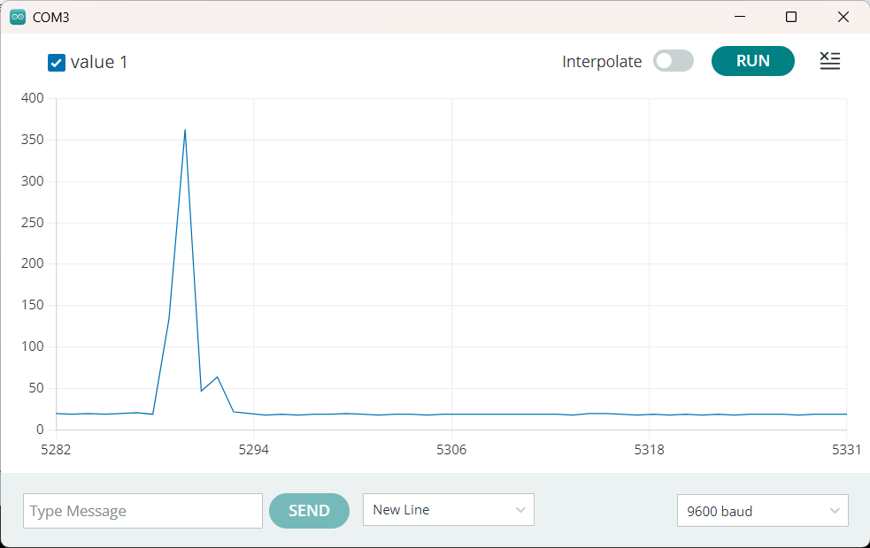
Shows the Arduino Serial Plotter visualizing variations in sound intensity, demonstrating the sensor's response to acoustic input.

# Diagrams

*Add caption explaining your workflow*

For Hardware:

# Schematic & Circuit

*Add caption explaining connections*

*Add caption explaining the schematic*

# Build Photos
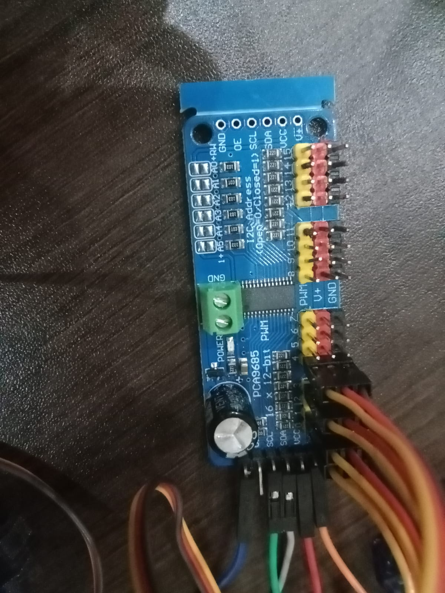
*PCA9685-: 16-channel, 12-bit PWM servo controller communicating over I²C*

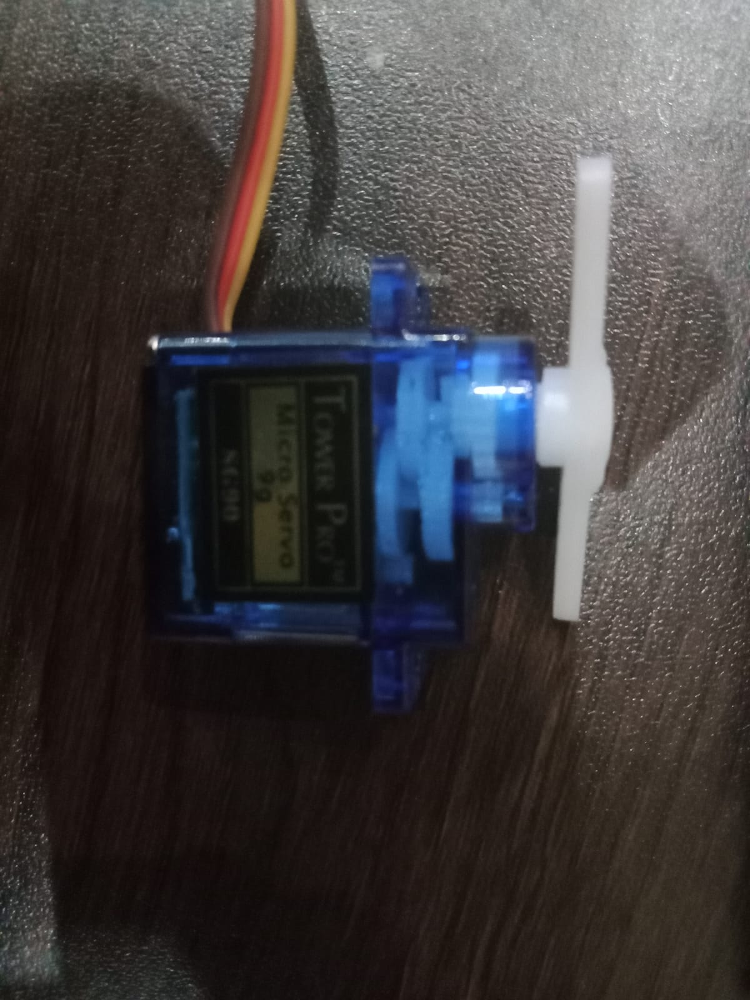
*servos SG90-: 9g micro servo, ~4.8–6V operating range; the actual muscle behind the chaos*

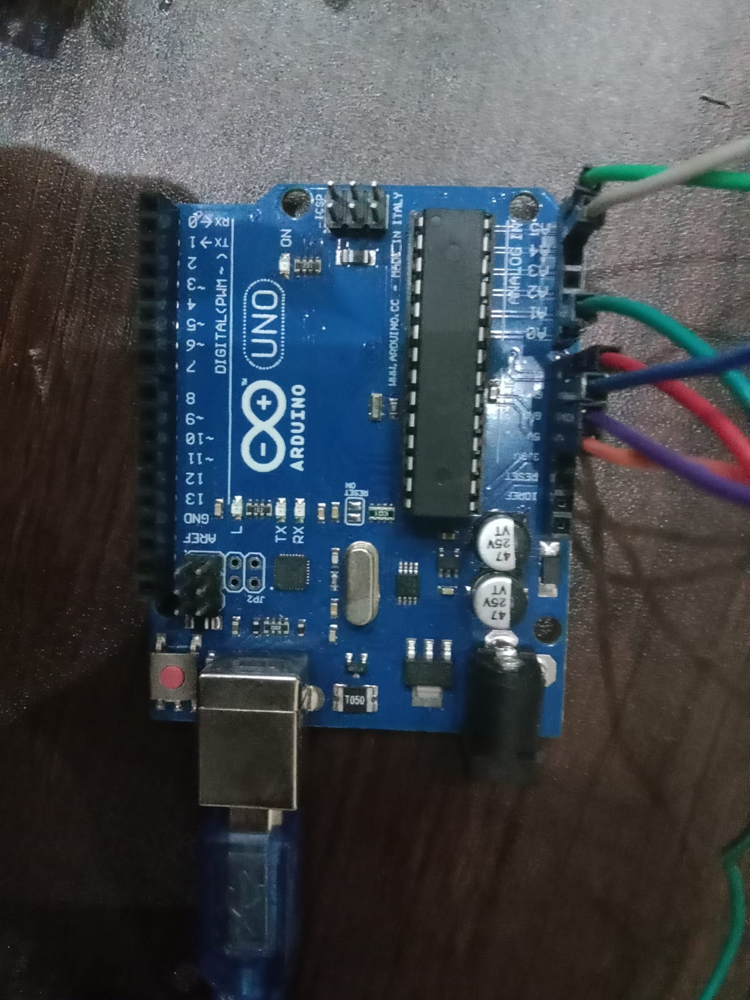
*Arduino uno-:ATmega328P microcontroller, 5V logic; the brain of the operation*

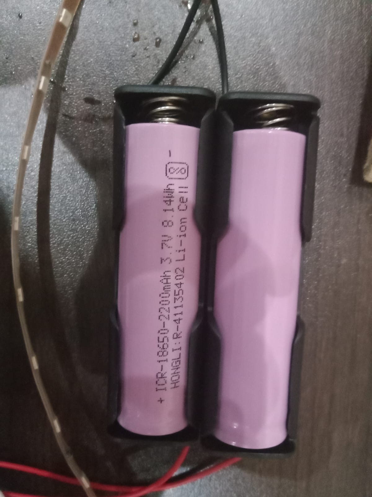
*Battery-: 2 × 3.3V cells wired in parallel to bump up available current without touching the voltage*

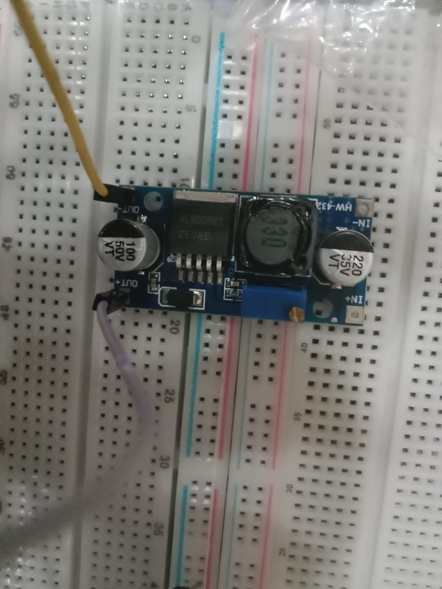
*boostconnector-:Steps the battery pack up to a clean, regulated 5V rail dedicated entirely to the servos*

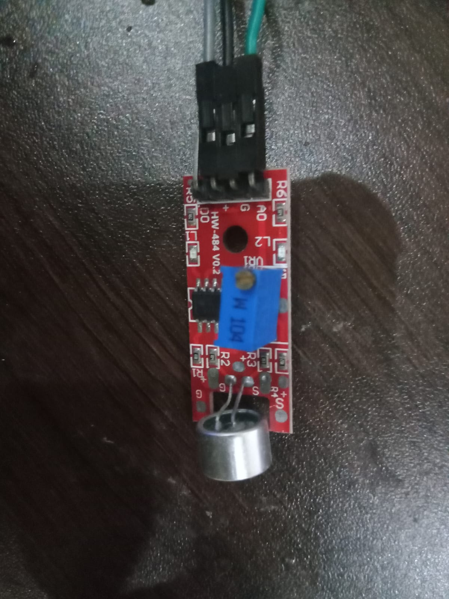
*ky038-: Analog sound detection via the AO pin*

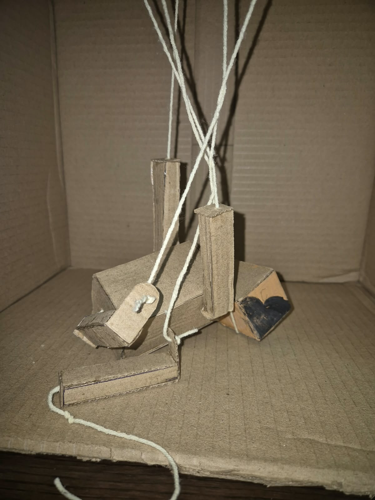
*Cardboard pieces were cut and assembled to form the head, torso, arms, and legs, creating the basic Pinocchio appearance.*

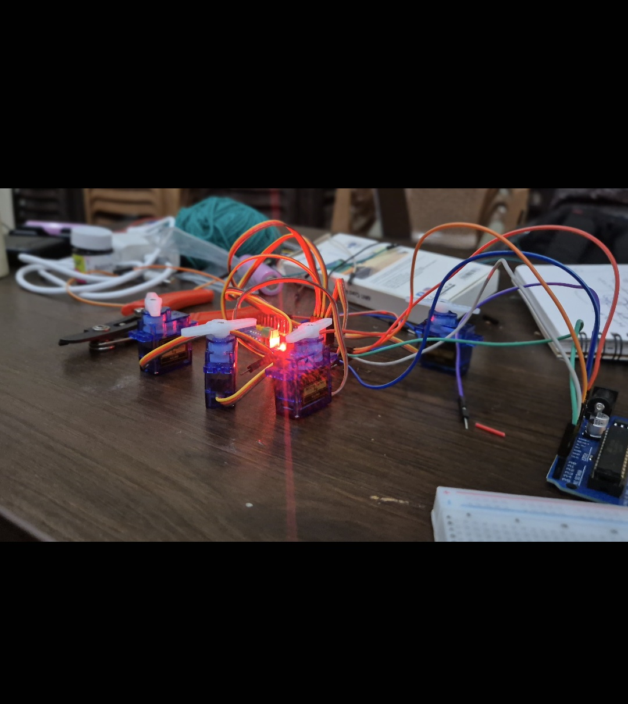
*Shows the four SG90 servo motors operating and driving the corresponding arm and leg movements of the cardboard Pinocchio..*

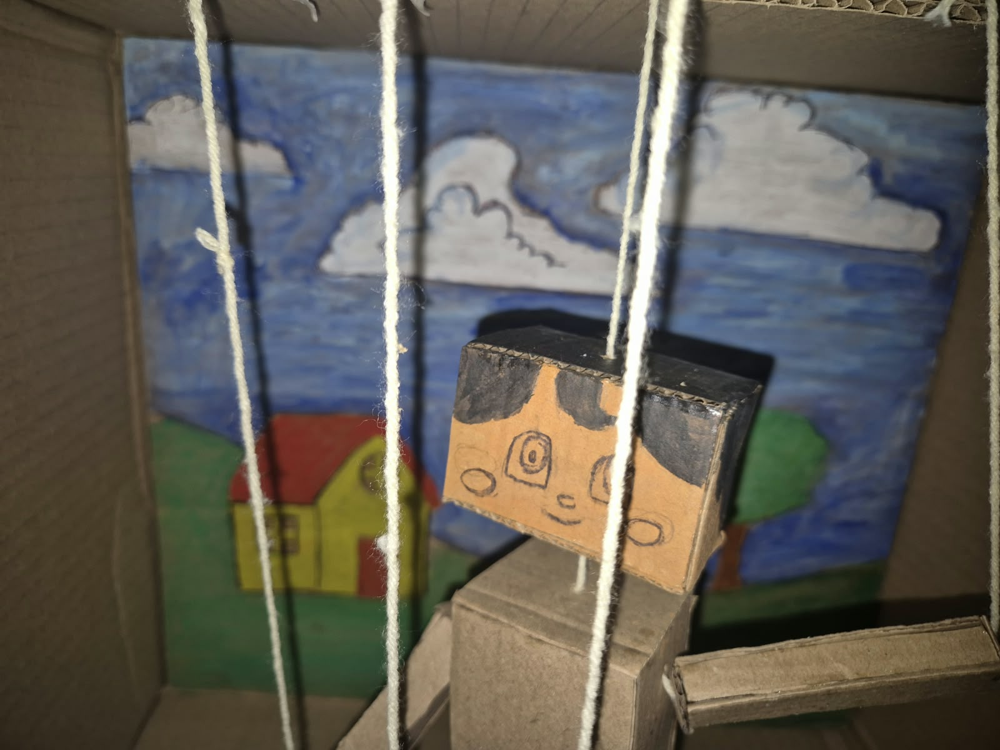
Shows the completed cardboard Pinocchio with the servo mechanism and electronic components fully assembled and ready for operation.*

### Project Demo
# Video
[Add your demo video link here]
*Explain what the video demonstrates*

# Additional Demos
[Add any extra demo materials/links]

## Team Contributions
- Snoopa K:
  - Created the movable arm and leg joints.
  - Connected the servos to the limbs using thread-based mechanisms.
  - Worked on the Arduino, PCA9685, sound sensor, and power connections.
  - Developed the Arduino program for the project.
  - Debugged the system and helped with final testing and documentation.
- Sai Krishna:
  - Designed and built the cardboard Pinocchio structure.
  - Mounted and positioned the four SG90 servo motors.
  - Tested the physical movement and adjusted the servo positions.
  - Integrated the KY-038 sound sensor for sound detection.
  - Tested different sound thresholds and servo angles.
---
Made with ❤️ at TinkerHub Useless Projects 

